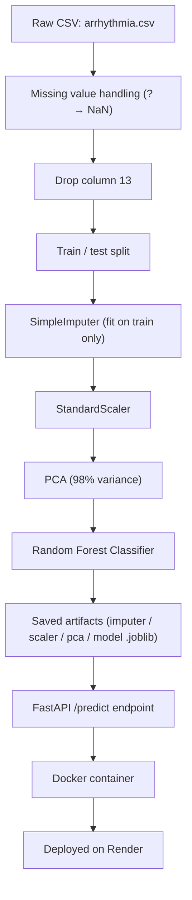

# Arrhythmia Classifier

A machine learning system that classifies cardiac arrhythmia from ECG-derived features, served as a production-style REST API. Raw signal features go through an imputation → scaling → PCA pipeline into a Random Forest classifier, with the fitted pipeline exported and served behind FastAPI in a Docker container.

## Problem

Given 278 ECG-derived measurements (rhythm intervals, wave amplitudes, and per-lead signal features), predict which of **16 classes** a patient falls into: "Normal" or one of 15 arrhythmia types (e.g. ischemic changes, bundle branch block, AV block, atrial fibrillation). This is a multi-class classification problem with a small sample size and a feature count close to the number of examples, which makes dimensionality reduction essential.

## Dataset

[UCI Machine Learning Repository — Arrhythmia Data Set](https://archive.ics.uci.edu/ml/datasets/Arrhythmia)
- 452 patient records, 279 raw attributes + 1 class label
- 16 classes (245 "Normal" examples, remainder spread across 15 arrhythmia types)
- Contains missing values (encoded as `"?"`) and one column with excessive missingness (dropped)

## Model Performance

Final model: **Random Forest** trained on **PCA-reduced** (98% variance retained), standardized, imputed features.

| Metric | Score |
|---|---|
| Test Accuracy | **68.1%** |
| Test F1 (weighted) | **60.0%** |

*(Source: [artifacts/metrics.json](artifacts/metrics.json), from a held-out 20% test split)*

## Pipeline



## API Contract

### `POST /predict`

**Request**
```json
{
  "features": [45.0, 0.0, 175.0, 63.0, 91.0, "... 278 floats total"]
}
```

**Response**
```json
{
  "predicted_class": 9,
  "class_name": "Left Boundle branch block",
  "confidence": 0.28
}
```

Other endpoints:
- `GET /health` — liveness check, returns `{"status": "ok"}`
- `GET /schema` — returns the exact ordered feature list and class name mapping, so consumers don't need to read source code to build a valid request

## Tech Stack

- **ML**: scikit-learn (Imputer, StandardScaler, PCA, RandomForestClassifier), pandas, numpy
- **API**: FastAPI, Pydantic, Uvicorn
- **Packaging**: Docker (`python:3.11-slim`)
- **Deployment**: Render

## Run Locally

```bash
python3 -m venv venv
source venv/bin/activate
pip install -r requirements.txt

# (Re)train and export artifacts (optional — artifacts/ is already committed)
python3 train_and_export.py

# Start the API
uvicorn main:app --reload
```

API available at `http://localhost:8000`.

## Run via Docker

```bash
docker build -t arrhythmia-api .
docker run -p 8000:8000 arrhythmia-api
```

## Live Deployment

🔗 [https://arrhythmia-api.onrender.com](https://arrhythmia-api.onrender.com)

Try it: `curl https://arrhythmia-api.onrender.com/health`

*Note: hosted on Render's free tier, which spins down after inactivity — the first request after idle may take ~30-60s to respond.*

## Acknowledgments

- [UCI Machine Learning Repository](https://archive.ics.uci.edu/ml/datasets/Arrhythmia)
- [Scikit-learn Documentation](https://scikit-learn.org/stable/)

---

*This repository has no official medical affiliation and is not intended for clinical use.*
